import Tabs from '@theme/Tabs';
import TabItem from '@theme/TabItem';

# Antes e depois (v1 → v2)

Para cada área, compare a estrutura do v1 com a do v2 nas abas, e veja abaixo o que mudou e qual problema da [auditoria](../auditoria-2026-09.md) cada mudança resolve. Os diagramas têm o botão **Expandir**.

## Multiempresa e permissões

<Tabs groupId="versao">
<TabItem value="antes" label="Antes (v1)" default>

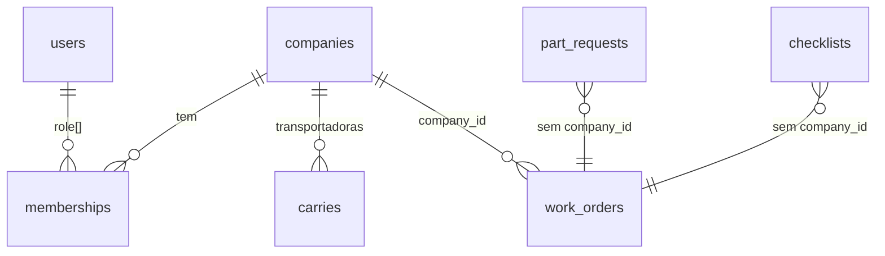

</TabItem>
<TabItem value="depois" label="Depois (v2)">

```mermaid
erDiagram
  org_groups ||--o{ organizations : agrupa
  organizations ||--o{ memberships : "unique(org, user)"
  users ||--o{ user_identities : "senha, OIDC, PIN"
  organizations ||--o{ actors : "quem agiu"
  memberships ||--o{ membership_roles : papéis
  roles ||--o{ role_permissions : "ação de negócio"
  organizations ||--o{ sharing_grants : "concede por nível"
```

</TabItem>
</Tabs>

| Mudança | Por quê |
| --- | --- |
| Isolamento por **RLS no Postgres**, falha fechada | No v1 um middleware com lista manual (com erro de digitação) deixava `GET /users` vazar usuários de todas as empresas com hash de senha |
| `org_id` em **toda** tabela | `part_requests`, `checklists`, `attachments`, `asset_readings` não tinham empresa |
| `unique (org_id, user_id)` em memberships | O mesmo usuário podia ser membro duas vezes da mesma empresa |
| Permissão por **ação de negócio**, negação por padrão, escopo "só o meu" | O motor do v1 ignorava toda regra `cannot`, todo papel lia tudo e quem pedia peça aprovava o próprio pedido |
| `actors` como autor de todo fato | O v1 gravava o id da empresa em `transitionedBy` |
| `user_identities` com OIDC e PIN | Login corporativo e mecânico sem e-mail no tablet compartilhado |
| Grupo econômico e concessões | O v1 não distinguia quem executa de quem é dono, nem quem pode ver o quê |

## Ativos

<Tabs groupId="versao">
<TabItem value="antes" label="Antes (v1)" default>

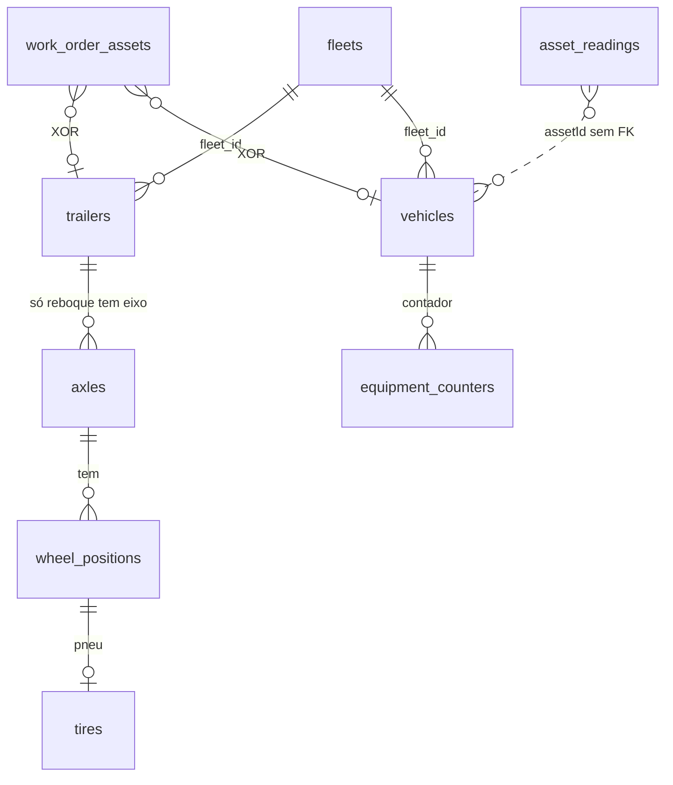

</TabItem>
<TabItem value="depois" label="Depois (v2)">

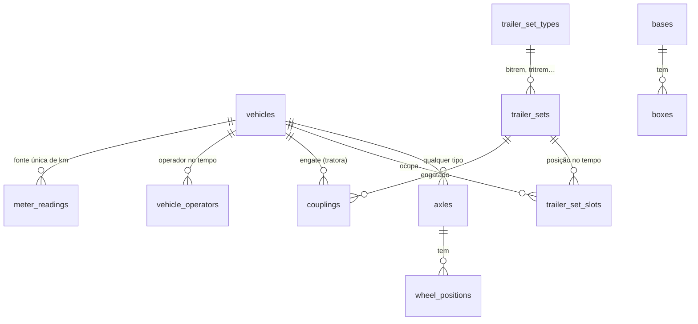

</TabItem>
</Tabs>

| Mudança | Por quê |
| --- | --- |
| Um só `vehicles` com tipo do CTB (caminhão-trator, caminhão, semirreboque, reboque, dolly) | No v1, `Vehicle` e `Trailer` duplicavam campos e toda referência era um par XOR ou um `assetId` sem FK |
| Eixos para **qualquer** veículo | O cavalo mecânico não tinha eixo nem posição de pneu |
| **Conjunto de implementos** com posições e histórico | Bitrem, tritrem e até 6 unidades sob um número de frota, com carreta trocando de conjunto |
| **Engate** com histórico sem sobreposição | Carretas trocam de cavalo; o custo segue o veículo físico |
| **Km do implemento derivado** dos engates | Carreta não tem hodômetro; o v1 não tinha km de carreta nem de pneu em carreta |
| Uma fonte de hodômetro (`meter_readings`) | O v1 tinha três fontes que divergiam (um caminhão com 195 mil km aparecia "OK") |
| Operador ao longo do tempo | A frota muda de transportadora |
| Bases com boxes | Clientes com várias oficinas |

## Ordem de serviço

<Tabs groupId="versao">
<TabItem value="antes" label="Antes (v1)" default>

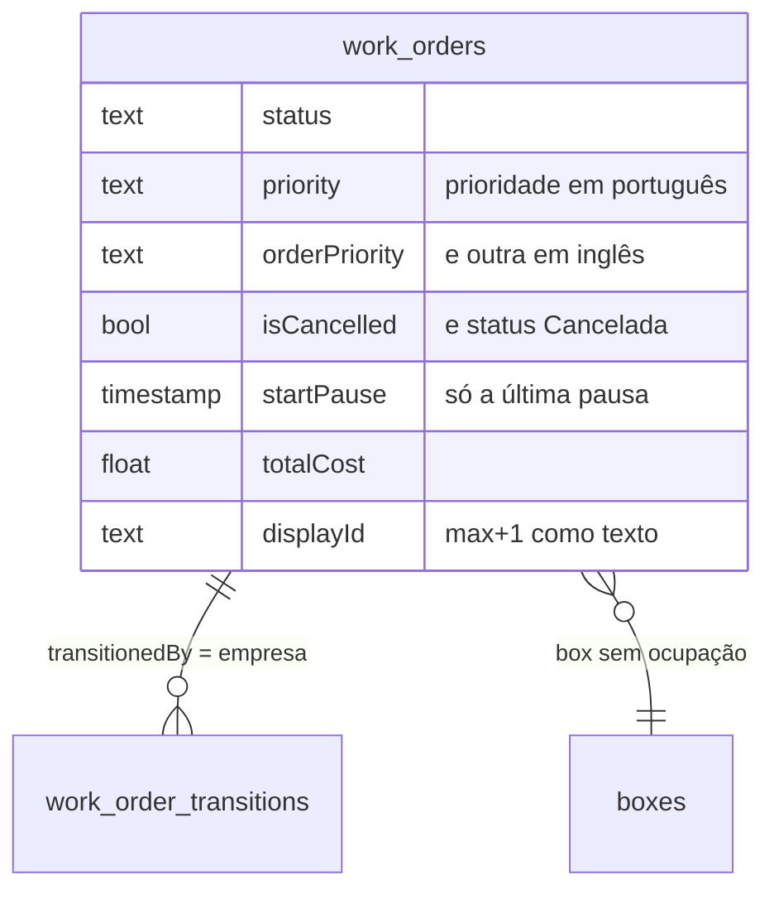

</TabItem>
<TabItem value="depois" label="Depois (v2)">

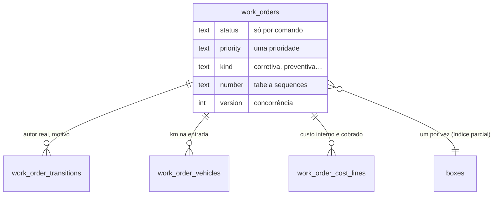

</TabItem>
</Tabs>

| Mudança | Por quê |
| --- | --- |
| Status só muda por comando, sempre com transição | O `PUT` do v1 reabria OS finalizada, e o create aceitava nascer "Finalizada" |
| Coluna `version` e update condicional | 4 inícios simultâneos gravavam 4 transições; cancelar + iniciar terminava em "Manutenção" |
| Uma OS aberta por veículo/conjunto e um box por OS, garantidos no banco | 5 creates simultâneos abriram 5 OS na mesma frota; um box aceitava várias OS |
| Numeração pela tabela `sequences` | O v1 ordenava o número como texto e travava depois de CO-9999 |
| Uma prioridade só; sem `isCancelled` | Conceitos duplicados |
| Durações a partir das transições | As colunas de pausa do v1 guardavam só a última pausa |
| Km na entrada gravado | Base do CPK, que o v1 não tinha |
| Custo interno e valor cobrado, em `numeric` | Dinheiro em `Float` e sem ponto de vista de dono × oficina |

## Execução e tempo trabalhado

<Tabs groupId="versao">
<TabItem value="antes" label="Antes (v1)" default>

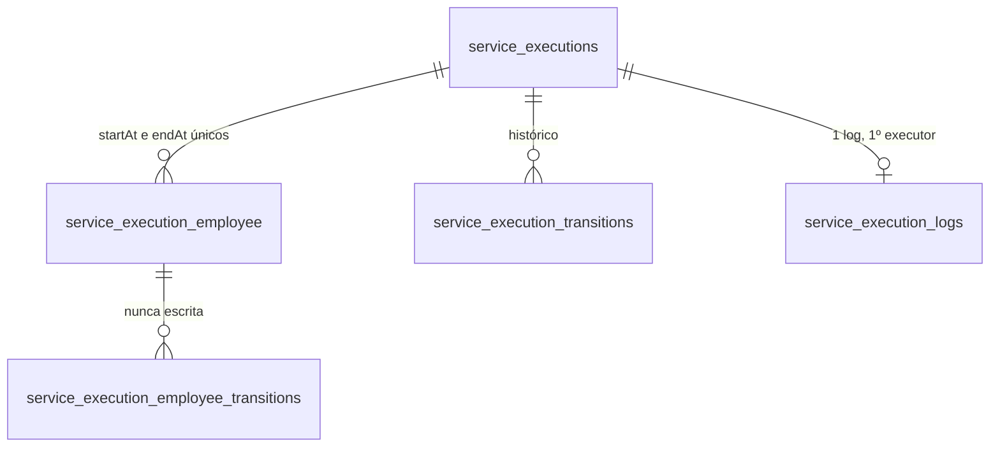

</TabItem>
<TabItem value="depois" label="Depois (v2)">

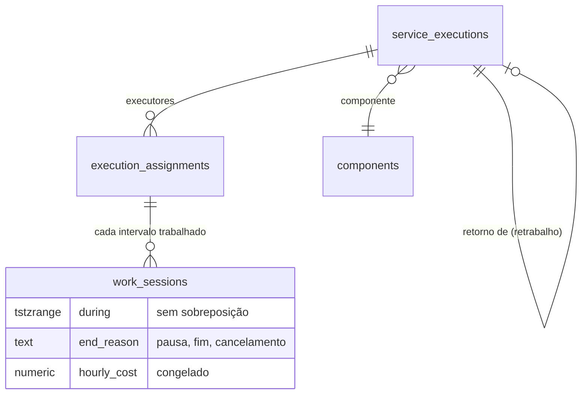

</TabItem>
</Tabs>

| Mudança | Por quê |
| --- | --- |
| **Sessões de trabalho** por executor | Issue #56: o v1 contava 78 horas para um serviço pausado 3 dias; o tempo trabalhado nunca foi gravado |
| Status do serviço **derivado** das sessões numa função só | Dois caminhos de escrita no v1: "Retomar" deixava o serviço pausado com executor rodando, e concluir o único executor não concluía o serviço |
| Pausa, cancelamento e conclusão fecham as sessões abertas | Cancelar serviço deixava o executor rodando para sempre |
| Componente e vínculo de retrabalho | Falhas recorrentes e taxa de retrabalho, que o v1 não tinha como calcular |
| Custo/hora congelado na sessão | Mão de obra por pessoa, sem mudar o passado quando o salário muda |
| Fim do log único por serviço | O v1 creditava todo o tempo ao primeiro executor, com tempo decorrido |

## Estoque

<Tabs groupId="versao">
<TabItem value="antes" label="Antes (v1)" default>

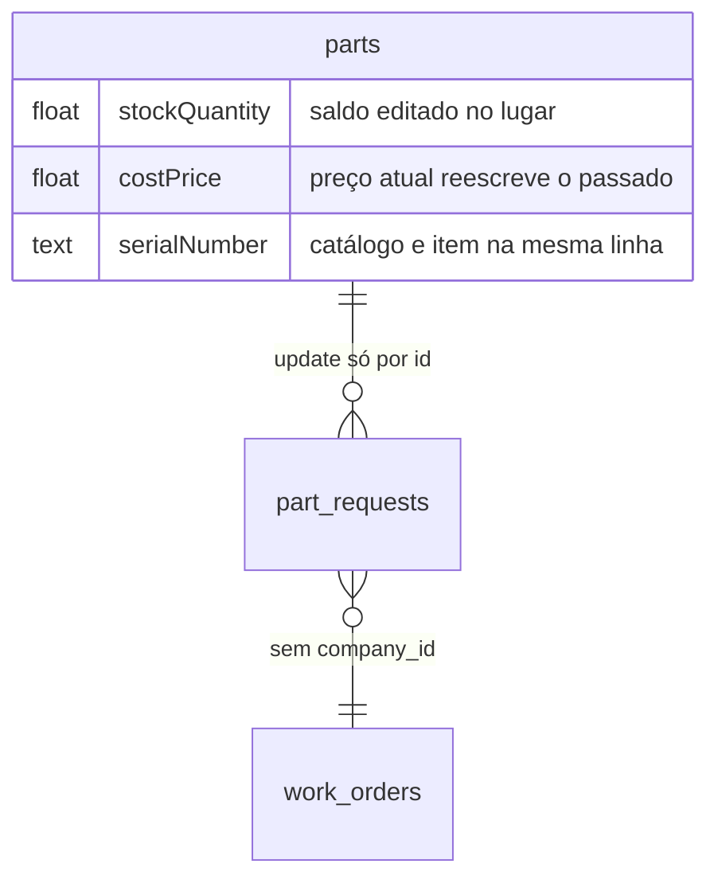

</TabItem>
<TabItem value="depois" label="Depois (v2)">

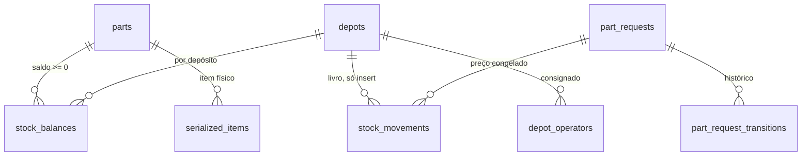

</TabItem>
</Tabs>

| Mudança | Por quê |
| --- | --- |
| **Livro de movimentações** e saldo com `check (quantity >= 0)` | 3 aprovações simultâneas deixaram o estoque em −2; aprovar −5 aumentava o estoque |
| Update condicional por status e saldo | A mesma requisição era aprovada duas vezes; devoluções simultâneas somavam em dobro |
| Preço congelado na movimentação, `numeric` | Editar o preço reescrevia o custo de OS antigas e rateios fechados |
| Catálogo separado do item serializado | `Part` do v1 era SKU e peça física ao mesmo tempo |
| Depósito com dono e local | Almoxarifado da Suzano dentro da Vale (consignado) |
| Quem pede não aprova (`check`) | Segregação de função inexistente no v1 |
| Status inicial sempre "pendente" | O cliente podia criar requisição já como "entregue" |

## Pneus

<Tabs groupId="versao">
<TabItem value="antes" label="Antes (v1)" default>

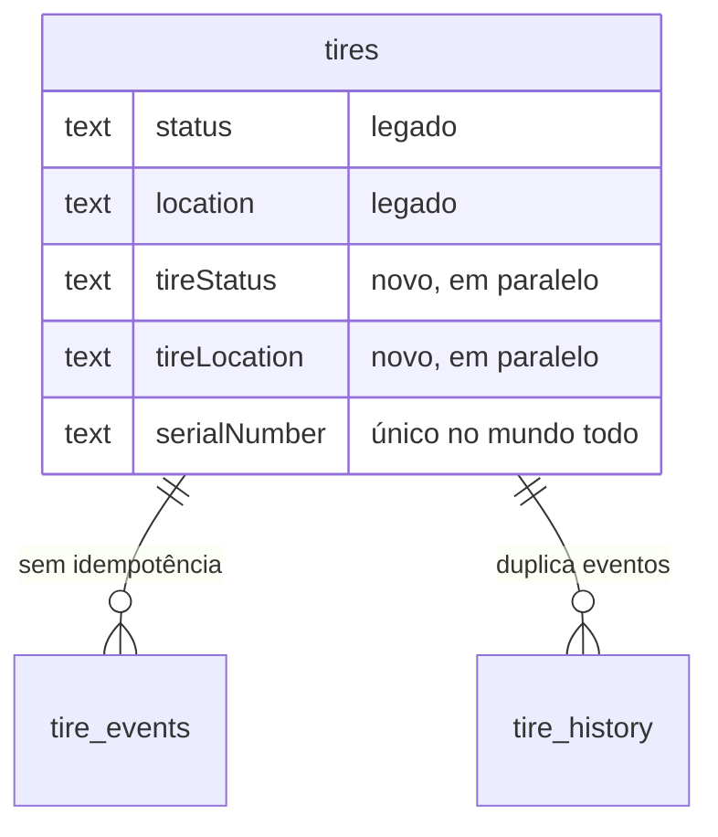

</TabItem>
<TabItem value="depois" label="Depois (v2)">

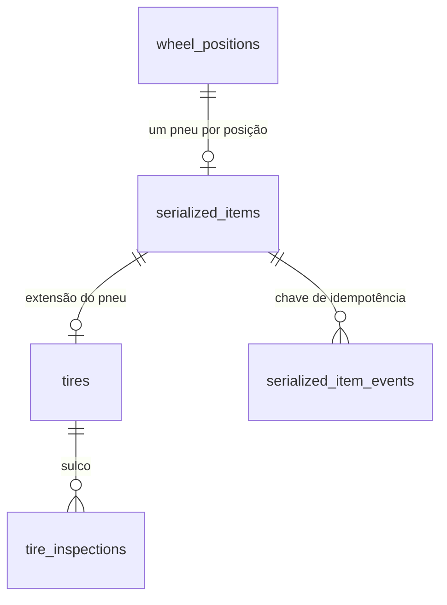

</TabItem>
</Tabs>

| Mudança | Por quê |
| --- | --- |
| Pneu como item serializado, um status e uma localização | 4 campos para 2 conceitos no v1 |
| Eventos com chave de idempotência | 3 retornos simultâneos da recapagem triplicavam o custo |
| Série e número de fogo únicos **por organização** | O v1 impedia duas transportadoras de terem o mesmo número |
| Km do pneu pelo veículo em que esteve, inclusive implemento | CPK de pneu, que o v1 não tinha em carreta |

## Checklists

<Tabs groupId="versao">
<TabItem value="antes" label="Antes (v1)" default>

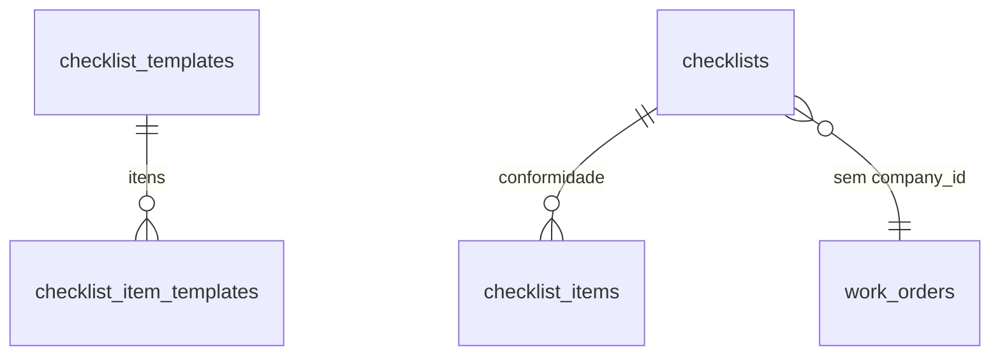

</TabItem>
<TabItem value="depois" label="Depois (v2)">

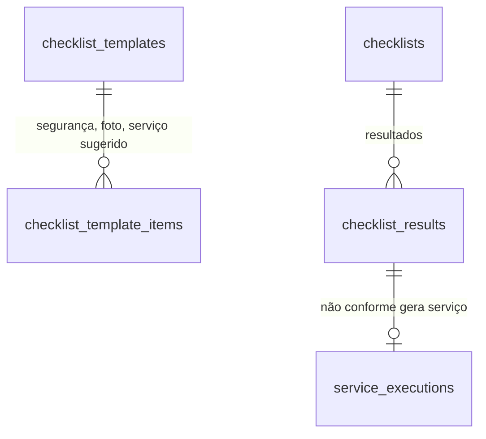

</TabItem>
</Tabs>

| Mudança | Por quê |
| --- | --- |
| `org_id` e RLS | Checklist do v1 não tinha empresa e era listado sem filtro |
| Não conformidade gera serviço com um toque | No v1 a não conformidade só alimentava analytics |
| Resultado por implemento do conjunto | Bitrem e tritrem inspecionados carreta por carreta |
| Versão do modelo guardada na execução | Alterar o modelo não muda checklists já feitos |
