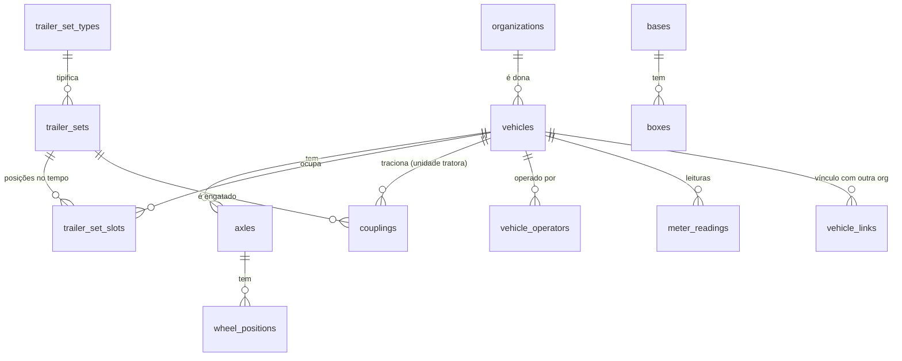

# Ativos

Cada peça física é um **veículo** com tipo formal do CTB; carretas andam em **conjuntos de implementos** identificados pelo número de frota; a **combinação** (unidade tratora + conjunto) é um período de engate. Histórico e custo ficam no veículo físico ([AST-8](../invariantes.md)). Termos no [glossário](../../produto/glossario.md#termos-da-v2).



## Veículos

```sql
create table vehicles (
  id              uuid primary key,
  org_id          uuid not null references organizations(id),   -- dono (ECO-1)
  kind            text not null check (kind in ('power_unit','rigid_truck','semi_trailer','full_trailer','dolly')),
  plate           text,                        -- dolly pode não ter placa
  chassis         text,
  renavam         text,
  fleet_code      text,                        -- código da unidade tratora no dia a dia (ex.: cavalo 812)
  brand           text,
  model           text,
  model_year      smallint,
  axle_layout_id  uuid references axle_layouts(id),
  has_odometer    boolean not null,            -- tratora e caminhão sempre; implemento só com hodômetro de cubo
  status          text not null default 'active' check (status in ('active','inactive','sold','scrapped')),
  deleted_at      timestamptz,
  created_at      timestamptz not null default now(),
  version         int not null default 0,
  check (kind not in ('power_unit','rigid_truck') or has_odometer)   -- AST-13
);

create table vehicle_status_transitions (      -- quando e por quem o veículo foi inativado, vendido, sucateado, reativado
  id            uuid primary key,
  org_id        uuid not null references organizations(id),
  vehicle_id    uuid not null references vehicles(id),
  from_status   text not null,
  to_status     text not null,
  reason        text,
  occurred_at   timestamptz not null default now(),
  actor_id      uuid not null references actors(id)
);
create unique index on vehicles (org_id, plate) where plate is not null and deleted_at is null;   -- AST-1
create unique index on vehicles (org_id, chassis) where chassis is not null and deleted_at is null;
```

## Eixos e posições de roda

Vale para qualquer tipo de veículo, inclusive caminhão-trator (AST-2). O estepe é uma posição do veículo sem eixo, para que o pneu nele continue rastreado.

```sql
create table axle_layouts (                    -- modelo reutilizável: "semirreboque 3 eixos rodagem dupla"
  id            uuid primary key,
  org_id        uuid references organizations(id),   -- null = modelo do sistema
  name          text not null,
  definition    jsonb not null                 -- eixos, tipo (direcional, tração, livre), rodagem simples/dupla
);

create table axles (
  id            uuid primary key,
  org_id        uuid not null references organizations(id),
  vehicle_id    uuid not null references vehicles(id),
  position      smallint not null check (position >= 1),
  kind          text not null check (kind in ('steer','drive','free','lift')),
  unique (vehicle_id, position)
);

create table wheel_positions (
  id            uuid primary key,
  org_id        uuid not null references organizations(id),
  vehicle_id    uuid not null references vehicles(id),
  axle_id       uuid references axles(id),     -- null só no estepe
  side          text check (side in ('left','right')),
  slot          text not null check (slot in ('single','inner','outer','spare')),
  spare_number  smallint check (spare_number >= 1),
  check ((slot = 'spare') = (axle_id is null)),
  check ((slot = 'spare') = (spare_number is not null)),
  check ((slot = 'spare') or side is not null)
);
create unique index on wheel_positions (axle_id, side, slot) where axle_id is not null;   -- corrige a duplicata do v1
create unique index on wheel_positions (vehicle_id, spare_number) where slot = 'spare';
```

## Conjuntos de implementos

```sql
create table trailer_set_types (               -- bitrem, tritrem, rodotrem, hexatrem, vanderleia, Romeu e Julieta
  id            uuid primary key,
  org_id        uuid references organizations(id),   -- null = tipo do sistema
  code          text not null,
  slots         smallint not null check (slots between 1 and 9),
  slot_kinds    text[] not null                -- tipo esperado em cada posição (semirreboque, dolly…)
);

create table trailer_sets (
  id            uuid primary key,
  org_id        uuid not null references organizations(id),
  type_id       uuid not null references trailer_set_types(id),
  fleet_code    text not null,                 -- número de frota: é por ele que a oficina procura
  deleted_at    timestamptz,
  created_at    timestamptz not null default now(),
  version       int not null default 0
);
create unique index on trailer_sets (org_id, fleet_code) where deleted_at is null;

create table trailer_set_slots (               -- qual implemento ocupa qual posição, em que período
  id            uuid primary key,
  org_id        uuid not null references organizations(id),
  trailer_set_id uuid not null references trailer_sets(id),
  slot          smallint not null check (slot >= 1),
  vehicle_id    uuid not null references vehicles(id),
  during        tstzrange not null,
  exclude using gist (vehicle_id with =, during with &&),                  -- AST-10: implemento em uma posição por vez
  exclude using gist (trailer_set_id with =, slot with =, during with &&)  -- AST-10: posição com um implemento por vez
);
-- AST-11 (número de posições respeita o tipo) é validado por trigger
```

## Engate e operador

```sql
create table couplings (                       -- combinação: unidade tratora + conjunto, num período
  id            uuid primary key,
  org_id        uuid not null references organizations(id),   -- dono do conjunto
  power_vehicle_id uuid references vehicles(id),               -- tratora cadastrada na organização
  external_power_plate text,                                   -- tratora de fora (ex.: da transportadora, caso Vale)
  external_power_org_id uuid references organizations(id),    -- quando a dona da tratora também usa o Facter
  start_meter   numeric(12,1),                                 -- km da tratora de fora no engate
  end_meter     numeric(12,1),                                 -- km da tratora de fora no desengate
  trailer_set_id uuid not null references trailer_sets(id),
  during        tstzrange not null,
  recorded_by   uuid not null references actors(id),
  check (num_nonnulls(power_vehicle_id, external_power_plate) = 1),               -- AST-15
  check (end_meter is null or start_meter is null or end_meter >= start_meter),
  exclude using gist (trailer_set_id with =, during with &&),    -- AST-7
  exclude using gist (power_vehicle_id with =, during with &&)
);

create table vehicle_operators (               -- transportadora que roda com o veículo (a frota muda de transportadora)
  id            uuid primary key,
  org_id        uuid not null references organizations(id),   -- dono do veículo
  vehicle_id    uuid not null references vehicles(id),
  operator_org_id uuid references organizations(id),         -- quando o operador também é cliente
  operator_name text,                                          -- quando não é
  during        tstzrange not null,
  exclude using gist (vehicle_id with =, during with &&),      -- ECO-7
  check (operator_org_id is not null or operator_name is not null)
);
```

## Hodômetro e horímetro

Uma fonte só por medidor (AST-6). O km de um implemento vem, nesta ordem: do hodômetro de cubo dele, quando tem; do hodômetro da tratora cadastrada, nos períodos de engate; do km informado no engate e no desengate, quando a tratora é de fora (AST-12). É o que dá km e CPK às carretas de quem não tem os cavalos, como a Vale.

```sql
create table meter_readings (
  id            uuid primary key,
  org_id        uuid not null references organizations(id),
  vehicle_id    uuid not null references vehicles(id),
  kind          text not null check (kind in ('odometer','hourmeter','hubodometer')),
  value         numeric(12,1) not null check (value >= 0),
  read_at       timestamptz not null,
  source        text not null check (source in ('work_order','manual','telematics','import')),
  source_ref    uuid,                          -- ex.: a OS em que foi lida
  recorded_by   uuid not null references actors(id),
  correction_of uuid references meter_readings(id),  -- AST-5: leitura menor só como correção explícita
  meter_install_id uuid not null references meter_installs(id)   -- a qual medidor físico a leitura pertence
);
create index on meter_readings (vehicle_id, kind, read_at desc);

create table meter_installs (                  -- troca de painel ou de hodômetro: a leitura cai sem ser erro
  id              uuid primary key,
  org_id          uuid not null references organizations(id),
  vehicle_id      uuid not null references vehicles(id),
  kind            text not null check (kind in ('odometer','hourmeter','hubodometer')),
  installed_at    timestamptz not null,
  initial_value   numeric(12,1) not null check (initial_value >= 0),
  previous_final_value numeric(12,1),          -- última leitura do medidor retirado
  recorded_by     uuid not null references actors(id)
);
```

O km rodado num período soma os trechos de cada medidor instalado; a troca não gera km negativo nem km fantasma (AST-5 vale dentro de cada medidor).

**Km de um implemento num período:** soma, para cada engate que se sobrepõe ao período, da diferença de hodômetro da unidade tratora dentro do trecho sobreposto. Calculado na camada de leitura e materializado por dia.

## Bases, boxes e vínculos

```sql
create table bases (
  id            uuid primary key,
  org_id        uuid not null references organizations(id),
  name          text not null,
  city          text,
  timezone      text,                          -- se diferente da organização
  unique (org_id, name)
);

create table boxes (
  id            uuid primary key,
  org_id        uuid not null references organizations(id),
  base_id       uuid not null references bases(id),        -- AST-9
  name          text not null,
  active        boolean not null default true,
  unique (base_id, name)
);

create table vehicle_links (                   -- o mesmo caminhão no dono e numa oficina de outra organização
  id              uuid primary key,
  owner_org_id    uuid not null references organizations(id),
  owner_vehicle_id uuid not null references vehicles(id),
  linked_org_id   uuid not null references organizations(id),
  linked_vehicle_id uuid not null references vehicles(id),
  created_at      timestamptz not null default now(),
  unique (linked_org_id, linked_vehicle_id)
);
```

A oficina cadastra o que atende; quando existe concessão ou solicitação, os dois cadastros são ligados por placa e chassi, e o dono enxerga pelo vínculo o que foi compartilhado. Ninguém edita o cadastro do outro.

## Invariantes garantidos aqui

AST-1, AST-2, AST-5 a AST-12, ECO-1, ECO-7.

## Pontos para decidir

- `fleet_code` também na unidade tratora (cavalo 812) ou só nos conjuntos: a proposta mantém nos dois, porque a oficina chama ambos por número.
- Tipos de conjunto do sistema cobrem os casos conhecidos; a organização pode criar os seus (ex.: hexatrem com dolly).
