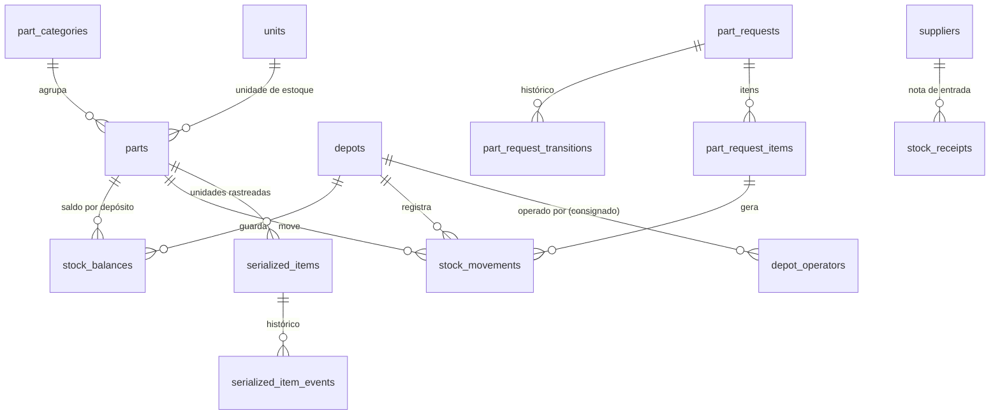

# Estoque

O saldo é a soma do **livro de movimentações** (STK-1) e nunca fica negativo (STK-2). A aprovação de uma requisição **reserva** a quantidade, para que outra retirada não leve a peça antes da entrega (STK-13): toda saída é um insert no livro mais um update condicional do saldo, na mesma transação. O preço de cada movimentação é congelado (STK-6). O depósito tem dono e local separados, o que permite o consignado (STK-9, STK-10).



## Catálogo

```sql
create table part_categories (
  id              uuid primary key,
  org_id          uuid not null references organizations(id),
  name            text not null,
  cost_allocation text not null default 'direct' check (cost_allocation in ('direct','shared')),  -- rateio
  unique (org_id, name)
);

create table units (
  id            uuid primary key,
  org_id        uuid references organizations(id),   -- null = unidade do sistema (un, L, kg, m…)
  code          text not null,
  fractional    boolean not null default false
);

create table suppliers (                       -- peças, pneus, recapagem e serviços externos
  id            uuid primary key,
  org_id        uuid not null references organizations(id),
  name          text not null,
  tax_id        text,
  kinds         text[] not null check (kinds <@ array['parts','tires','retread','services']),
  unique (org_id, tax_id)
);

create table parts (                           -- o SKU: catálogo, sem quantidade
  id                  uuid primary key,
  org_id              uuid not null references organizations(id),
  category_id         uuid not null references part_categories(id),
  part_number         text not null,
  name                text not null,
  brand               text,
  stock_unit_id       uuid not null references units(id),
  consumption_unit_id uuid references units(id),
  conversion_factor   numeric(14,6) not null default 1 check (conversion_factor > 0),
  tracking            text not null default 'quantity' check (tracking in ('quantity','serialized')),
  supplier_id         uuid references suppliers(id),
  deleted_at          timestamptz,
  unique (org_id, part_number)
);
```

No v1, `Part` misturava catálogo e item físico (número de série na mesma linha do saldo). Aqui o catálogo não tem saldo nem série.

## Depósitos e saldo

```sql
create table depots (
  id            uuid primary key,
  org_id        uuid not null references organizations(id),   -- dono do estoque
  host_org_id   uuid not null references organizations(id),   -- onde fica fisicamente
  base_id       uuid references bases(id),                    -- base do anfitrião
  name          text not null,
  unique (org_id, name)
);

create table depot_operators (                 -- consignado: o dono autoriza a oficina a movimentar
  depot_id        uuid not null references depots(id),
  operator_org_id uuid not null references organizations(id),
  granted_by      uuid not null references actors(id),
  valid_during    tstzrange not null,
  primary key (depot_id, operator_org_id)
);

create table stock_balances (
  org_id        uuid not null references organizations(id),
  depot_id      uuid not null references depots(id),
  part_id       uuid not null references parts(id),
  quantity      numeric(14,4) not null default 0 check (quantity >= 0),   -- STK-2
  reserved_qty  numeric(14,4) not null default 0 check (reserved_qty >= 0 and reserved_qty <= quantity),  -- STK-13
  minimum_qty   numeric(14,4) check (minimum_qty >= 0),                  -- abaixo disto, alerta de reposição
  reorder_qty   numeric(14,4) check (reorder_qty > 0),                   -- quanto sugerir comprar
  average_cost  numeric(14,4) not null default 0,
  version       int not null default 0,
  primary key (depot_id, part_id)
);
```

**Disponível** = `quantity - reserved_qty`. Quando o disponível fica abaixo de `minimum_qty`, um evento do outbox avisa o responsável pelo depósito e entra no resumo semanal: é a previsão de falta de peça, antes de a OS parar esperando por ela.

```sql
create table stock_receipts (                  -- entrada de compra, com a nota fiscal
  id              uuid primary key,
  org_id          uuid not null references organizations(id),
  depot_id        uuid not null references depots(id),
  supplier_id     uuid not null references suppliers(id),
  invoice_number  text not null,
  invoice_date    date not null,
  received_by     uuid not null references actors(id),
  received_at     timestamptz not null default now(),
  unique (org_id, supplier_id, invoice_number)   -- a mesma nota não entra duas vezes
);
```

## Livro de movimentações

```sql
create table stock_movements (                 -- só insert
  id              uuid primary key,
  org_id          uuid not null references organizations(id),   -- dono do estoque
  depot_id        uuid not null references depots(id),
  part_id         uuid not null references parts(id),
  kind            text not null check (kind in ('purchase_in','issue','return','transfer_out','transfer_in','adjustment_in','adjustment_out','initial_balance')),
  quantity        numeric(14,4) not null check (quantity > 0),  -- sempre positiva; o kind dá o sentido
  unit_cost       numeric(14,4) not null check (unit_cost >= 0), -- congelado: custo médio no momento (STK-6)
  currency        char(3) not null,
  consumed_at     timestamptz not null,       -- data do consumo, não da requisição (base do rateio)
  part_request_item_id uuid references part_request_items(id),
  receipt_id      uuid references stock_receipts(id),   -- purchase_in sempre tem nota
  transfer_id     uuid,                       -- liga transfer_out e transfer_in (STK-11)
  reason          text,
  actor_id        uuid not null references actors(id),  -- pode ser ator da organização operadora
  actor_org_id    uuid not null references organizations(id),
  created_at      timestamptz not null default now(),
  check ((kind = 'purchase_in') = (receipt_id is not null))
);
create index on stock_movements (org_id, consumed_at);
```

**Aprovar reserva, entregar baixa, e nada acontece duas vezes:**

```sql
-- aprovar um item: reserva, sem deixar o disponível negativo
update stock_balances
   set reserved_qty = reserved_qty + $qty, version = version + 1
 where depot_id = $depot and part_id = $part and quantity - reserved_qty >= $qty;   -- 0 linhas = sem disponível (409)

-- entregar: baixa o saldo e a reserva juntos, na mesma transação da mudança de status
update stock_balances
   set quantity = quantity - $qty, reserved_qty = reserved_qty - $qty, version = version + 1
 where depot_id = $depot and part_id = $part and reserved_qty >= $qty;
insert into stock_movements (...) values (...);
```

Rejeitar ou cancelar um item aprovado devolve a reserva na mesma transação.

**Consignado e RLS:** o saldo e o livro pertencem ao dono do estoque (Suzano), mas quem movimenta é a oficina (Vale). A movimentação não passa por exceção no RLS: é feita por uma função `security definer` (`issue_from_depot`), que confere em `depot_operators` se a organização do contexto pode operar aquele depósito, grava com `org_id` do dono e `actor_org_id` da oficina, e recusa qualquer outro caso. A oficina vê os saldos desses depósitos pela visão compartilhada, não pelas tabelas do dono.

## Itens serializados

```sql
create table serialized_items (                -- bateria, compressor, pneu (pneu tem extensões próprias)
  id              uuid primary key,
  org_id          uuid not null references organizations(id),
  part_id         uuid not null references parts(id),
  serial_number   text not null,
  status          text not null check (status in ('in_stock','installed','in_repair','scrapped','sold')),
  depot_id        uuid references depots(id),
  vehicle_id      uuid references vehicles(id),
  wheel_position_id uuid references wheel_positions(id),
  warranty_until  date,
  version         int not null default 0,
  unique (org_id, serial_number),                                   -- TIR-1 vale para todos
  check (num_nonnulls(depot_id, vehicle_id) <= 1)                   -- STK-12: um lugar por vez
);
create unique index on serialized_items (wheel_position_id) where status = 'installed';   -- AST-3

create table serialized_item_events (          -- só insert: compra, instalação, remoção, reparo, baixa
  id              uuid primary key,
  org_id          uuid not null references organizations(id),
  item_id         uuid not null references serialized_items(id),
  kind            text not null,
  vehicle_id      uuid references vehicles(id),
  wheel_position_id uuid references wheel_positions(id),
  work_order_id   uuid references work_orders(id),
  meter_value     numeric(12,1),               -- km no evento (derivado para implementos)
  cost            numeric(14,2),
  occurred_at     timestamptz not null,
  actor_id        uuid not null references actors(id),
  idempotency_key text not null,
  unique (item_id, idempotency_key)             -- TIR-2: o mesmo evento não entra duas vezes
);
```

## Requisições

```sql
create table part_requests (                   -- um pedido com vários itens: um serviço, uma aprovação
  id                uuid primary key,
  org_id            uuid not null references organizations(id),   -- quem pede (oficina executora)
  work_order_id     uuid not null references work_orders(id),
  service_execution_id uuid references service_executions(id),
  depot_id          uuid not null references depots(id),
  status            text not null default 'pending' check (status in ('pending','approved','partially_approved','rejected','delivered','canceled')),
  requested_by      uuid not null references actors(id),
  approved_by       uuid references actors(id),
  version           int not null default 0,
  created_at        timestamptz not null default now(),
  check (approved_by is null or approved_by <> requested_by)       -- PLT-5: quem pede não aprova
);

create table part_request_items (
  id                uuid primary key,
  org_id            uuid not null references organizations(id),
  part_request_id   uuid not null references part_requests(id),
  part_id           uuid not null references parts(id),
  requested_qty     numeric(14,4) not null check (requested_qty > 0),
  approved_qty      numeric(14,4) check (approved_qty >= 0 and approved_qty <= requested_qty),   -- STK-4; 0 = recusado
  delivered_qty     numeric(14,4) not null default 0 check (delivered_qty >= 0),
  returned_qty      numeric(14,4) not null default 0 check (returned_qty >= 0 and returned_qty <= delivered_qty),
  check (approved_qty is null or delivered_qty <= approved_qty),
  unique (part_request_id, part_id)
);

create table part_request_transitions (
  id              uuid primary key,
  org_id          uuid not null references organizations(id),
  part_request_id uuid not null references part_requests(id),
  part_request_item_id uuid references part_request_items(id),   -- quando a mudança é de um item
  from_status     text,
  to_status       text not null,
  quantity        numeric(14,4),
  note            text,
  occurred_at     timestamptz not null default now(),
  actor_id        uuid not null references actors(id)
);
```

O status inicial não vem do cliente (STK-5): o DTO de criação não tem o campo, e o banco usa o default.

## Invariantes garantidos aqui

STK-1 a STK-13, PLT-5, AST-3, TIR-1, TIR-2.

## Decidido em 26/09/2026

- **Custo médio móvel por depósito.** Em qual unidade o custo é guardado (a de estoque, como balde, ou a de consumo, como litro) é outra decisão, da [proposta de convenção de custo por unidade](../../produto/propostas/part-cost-convention.mdx), e fica para antes da fase 2.
- **Fornecedores** num cadastro por organização, compartilhado por peças, pneus, recapagem e serviços externos.
- **Transferência entre depósitos de organizações diferentes** só dentro do mesmo grupo ou com concessão explícita.
