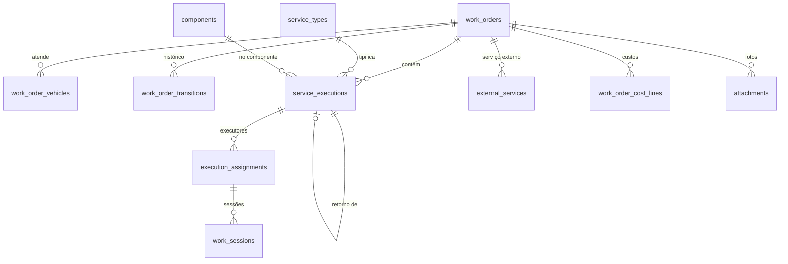

# Manutenção

A OS pertence à organização que executa ([ECO-1](../invariantes.md)). O tempo trabalhado é a soma das **sessões de trabalho** de cada executor (SVC-7), e o status do serviço é derivado das sessões por uma única função (SVC-1). Resolve a issue #56 na raiz: o fato "quanto cada pessoa trabalhou" passa a existir.



## Catálogos

```sql
create table service_categories (             -- configurável pela organização (no v1 era enum fixo de 6)
  id            uuid primary key,
  org_id        uuid references organizations(id),   -- null = categoria do sistema
  name          text not null
);

create table service_types (
  id              uuid primary key,
  org_id          uuid not null references organizations(id),
  category_id     uuid references service_categories(id),
  name            text not null,
  applies_to      text[] not null,             -- tipos de veículo: power_unit, semi_trailer…
  location_kinds  text[] not null default '{none}',   -- none, vehicle, side, directional, axle, wheel, structural
  default_component_id uuid references components(id),  -- pré-sugere o componente (sem atrito)
  active          boolean not null default true,
  unique (org_id, name)
);

create table components (                      -- embreagem, freio, suspensão…: base de falhas recorrentes
  id            uuid primary key,
  org_id        uuid references organizations(id),   -- null = componente do sistema
  code          text not null,
  parent_id     uuid references components(id),       -- hierarquia: freio > lona de freio
  applies_to    text[] not null
);
```

## Ordem de serviço

```sql
create table work_orders (
  id                uuid primary key,
  org_id            uuid not null references organizations(id),   -- quem executa
  number            text not null,                                -- da tabela sequences (WO-5)
  base_id           uuid not null references bases(id),
  box_id            uuid references boxes(id),
  status            text not null check (status in ('queued','in_maintenance','paused','finished','canceled')),
  kind              text not null check (kind in ('corrective','preventive','inspection','overhaul','emergency')),
  priority          text not null check (priority in ('low','medium','high','critical')),   -- uma prioridade só
  origin            text not null check (origin in ('manual','maintenance_request','checklist','preventive')),
  maintenance_request_id uuid references maintenance_requests(id),
  customer_id       uuid references workshop_customers(id),  -- dono do ativo, quando a oficina é terceira
  stoppage_id       uuid references vehicle_stoppages(id),   -- a parada que trouxe o veículo (disponibilidade)
  reported_problem  text,
  diagnosis         text,
  opened_by         uuid not null references actors(id),
  released_by       uuid references actors(id),
  created_at        timestamptz not null default now(),
  version           int not null default 0,
  unique (org_id, number)
);
-- WO-4: um box com no máximo uma OS em manutenção
create unique index on work_orders (box_id) where status = 'in_maintenance';
```

```sql
create table workshop_customers (              -- clientes da oficina, usem o Facter ou não
  id              uuid primary key,
  org_id          uuid not null references organizations(id),   -- a oficina
  name            text not null,
  tax_id          text,
  customer_org_id uuid references organizations(id),            -- quando o cliente também usa o Facter
  unique (org_id, tax_id)
);

create table vehicle_stoppages (               -- quando o veículo parou de operar, antes de existir OS
  id              uuid primary key,
  org_id          uuid not null references organizations(id),
  vehicle_id      uuid references vehicles(id),
  trailer_set_id  uuid references trailer_sets(id),
  stopped_at      timestamptz not null,        -- informado por quem relatou; pode ser anterior ao registro
  reason          text not null check (reason in ('breakdown','accident','checklist_fail','scheduled','tire','other')),
  location_note   text,                        -- "BR-116 km 230", pátio, cliente
  reported_by     uuid not null references actors(id),
  recorded_at     timestamptz not null default now(),
  released_at     timestamptz,                 -- volta a operar: liberação da última OS da parada
  check (num_nonnulls(vehicle_id, trailer_set_id) = 1),
  check (released_at is null or released_at >= stopped_at)
);

create table work_order_forecasts (            -- previsão de liberação; cada mudança fica registrada
  id              uuid primary key,
  org_id          uuid not null references organizations(id),
  work_order_id   uuid not null references work_orders(id),
  promised_release_at timestamptz not null,
  reason          text,                        -- por que a previsão mudou (peça atrasou…)
  set_by          uuid not null references actors(id),
  set_at          timestamptz not null default now()
);
create index on work_order_forecasts (work_order_id, set_at desc);
```

- **Tempo parado do veículo** vai de `stopped_at` da parada até `released_at`, e não da abertura da OS: o guincho e a espera na estrada contam (WO-10). OS aberta sem parada registrada usa a própria abertura como início.
- **Previsão × realizado:** a previsão vigente é a última de `work_order_forecasts`; comparar com a liberação mede a previsibilidade da oficina, e o número de mudanças mostra onde ela se perde.

O status só muda por comando (WO-1). Toda mudança grava uma linha em `work_order_transitions` na mesma transação. Não existe coluna de "início da pausa" ou "fim da pausa": as durações saem das transições.

```sql
create table work_order_transitions (
  id              uuid primary key,
  org_id          uuid not null references organizations(id),
  work_order_id   uuid not null references work_orders(id),
  from_status     text,
  to_status       text not null,
  pause_reason    text references pause_reasons(code),
  note            text,
  occurred_at     timestamptz not null default now(),   -- relógio do servidor
  actor_id        uuid not null references actors(id)
);
create index on work_order_transitions (work_order_id, occurred_at);

create table work_order_vehicles (             -- o que está na OS: veículo avulso ou conjunto
  id              uuid primary key,
  org_id          uuid not null references organizations(id),
  work_order_id   uuid not null references work_orders(id),
  vehicle_id      uuid references vehicles(id),
  trailer_set_id  uuid references trailer_sets(id),
  entry_reading_id uuid references meter_readings(id),  -- km na entrada (fato do CPK)
  check (vehicle_id is not null or trailer_set_id is not null)
);
```

**WO-3 (uma OS aberta por conjunto ou veículo, em cada organização executora)** fica numa tabela auxiliar `open_work_order_locks (org_id, target_id, work_order_id, primary key (org_id, target_id))`, inserida ao abrir e apagada ao finalizar ou cancelar, na mesma transação. É a forma de ter unicidade entre tabelas sem trigger complexo. A chave inclui `org_id` de propósito: duas oficinas podem manter o mesmo conjunto (ADR-011), e uma chave só em `target_id` barraria a segunda e revelaria que a outra tem OS aberta.

## Serviços

```sql
create table service_executions (
  id                uuid primary key,
  org_id            uuid not null references organizations(id),
  work_order_id     uuid not null references work_orders(id),
  service_type_id   uuid not null references service_types(id),
  component_id      uuid references components(id),       -- fato das falhas recorrentes
  vehicle_id        uuid not null references vehicles(id), -- a unidade física atendida
  axle_id           uuid references axles(id),
  wheel_position_id uuid references wheel_positions(id),
  side              text check (side in ('left','right','front','rear')),
  structural_position smallint,
  rework_of_id      uuid references service_executions(id),   -- retrabalho (indicador 10)
  status            text not null check (status in ('pending','in_progress','paused','completed','canceled')),
  created_by        uuid not null references actors(id),
  created_at        timestamptz not null default now(),
  version           int not null default 0,
  check (rework_of_id is null or rework_of_id <> id)
);
```

`status` é derivado das sessões e das designações por uma função única (SVC-1), recalculada na mesma transação de cada comando. Fica gravado para leitura rápida, mas nunca é escrito diretamente.

## Executores e sessões de trabalho

```sql
create table pause_reasons (                   -- uma lista só para OS e sessão; fixa, para comparar oficinas
  code          text primary key,              -- waiting_part, external_service, no_box, no_staff,
                                               -- shift_end, meal_break, rest_break, other_service, other
  planned       boolean not null               -- intervalo e fim de turno são planejados; não são tempo perdido
);

create table execution_assignments (
  id                  uuid primary key,
  org_id              uuid not null references organizations(id),
  service_execution_id uuid not null references service_executions(id),
  employee_id         uuid not null references employees(id),
  assigned_at         timestamptz not null default now(),
  removed_at          timestamptz,
  assigned_by         uuid not null references actors(id)
);
create unique index on execution_assignments (service_execution_id, employee_id) where removed_at is null;

create table work_sessions (                   -- intervalo em que a pessoa trabalhou de fato
  id                uuid primary key,
  org_id            uuid not null references organizations(id),
  assignment_id     uuid not null references execution_assignments(id),
  employee_id       uuid not null references employees(id),   -- desnormalizado para o exclude abaixo
  during            tstzrange not null,          -- aberto à direita enquanto a sessão corre
  end_reason        text check (end_reason in ('paused','completed','canceled','shift_end','break','service_paused','work_order_paused')),
  pause_reason      text references pause_reasons(code),   -- quando end_reason = paused
  hourly_cost       numeric(14,2),               -- custo/hora do cargo congelado ao fechar (ADR-009)
  labor_cost        numeric(14,2),               -- com hora extra, noturno e feriado, congelado ao fechar (SVC-10)
  adjusted_by       uuid references actors(id),  -- SVC-8: horário ajustado à mão, com autor
  adjustment_note   text,
  started_by        uuid not null references actors(id),
  exclude using gist (assignment_id with =, during with &&),   -- SVC-5
  exclude using gist (employee_id with =, during with &&),     -- SVC-12: uma frente de trabalho por pessoa
  check (not isempty(during))                                   -- SVC-6
);
```

- **Tempo trabalhado** do executor no serviço = soma de `upper(during) - lower(during)` das sessões.
- **Pausar o serviço** fecha as sessões abertas com `end_reason = 'service_paused'`; **pausar a OS**, com `work_order_paused`. Cascata explícita, uma sessão por pessoa, nada de `updateMany` sem rastro.
- **Intervalo:** com `shifts.auto_pause_breaks`, o início de um trecho `meal_break` ou `rest_break` fecha as sessões abertas com `end_reason = 'break'`; o "Voltar" do mecânico reabre as que o intervalo fechou, numa ação só.
- **Cancelar o serviço ou a OS** fecha todas as sessões abertas (SVC-3, WO-6), que era o bug que deixava executor "rodando para sempre" no v1.

## Serviços externos, custos e fotos

```sql
create table external_services (
  id              uuid primary key,
  org_id          uuid not null references organizations(id),
  work_order_id   uuid not null references work_orders(id),
  service_execution_id uuid references service_executions(id),
  supplier_id     uuid not null references suppliers(id),
  description     text not null,
  cost            numeric(14,2) not null check (cost >= 0),
  currency        char(3) not null,
  invoice_number  text,                        -- nota fiscal: auditoria e integração com o ERP
  invoice_date    date,
  recorded_by     uuid not null references actors(id),
  created_at      timestamptz not null default now()
);

create table work_order_cost_lines (           -- ECO-6: custo interno e valor cobrado lado a lado
  id              uuid primary key,
  org_id          uuid not null references organizations(id),
  work_order_id   uuid not null references work_orders(id),
  kind            text not null check (kind in ('part','labor','external','allocation','other')),
  source_ref      uuid,                        -- movimentação, sessão, serviço externo…
  internal_cost   numeric(14,2) not null default 0,
  billed_amount   numeric(14,2),               -- preenchido quando a oficina cobra um cliente
  currency        char(3) not null,
  stock_owner_org_id uuid references organizations(id),   -- STK-10: peça consignada é custo do dono do estoque
  created_at      timestamptz not null default now()
);

create table attachments (
  id              uuid primary key,
  org_id          uuid not null references organizations(id),
  work_order_id   uuid references work_orders(id),
  service_execution_id uuid references service_executions(id),
  vehicle_id      uuid references vehicles(id),
  checklist_result_id uuid references checklist_results(id),   -- foto de um item de checklist (CHK-2)
  storage_key     text not null,               -- objeto no R2, já comprimido no aparelho
  thumbnail_key   text,
  mime_type       text not null,
  size_bytes      int not null check (size_bytes > 0),
  taken_at        timestamptz,
  uploaded_by     uuid not null references actors(id),
  created_at      timestamptz not null default now()
);

create table work_order_notes (
  id              uuid primary key,
  org_id          uuid not null references organizations(id),
  work_order_id   uuid not null references work_orders(id),
  body            text not null,                -- renderizado como texto, nunca HTML (fim do XSS do v1)
  mentions        uuid[] not null default '{}',
  author_id       uuid not null references actors(id),
  created_at      timestamptz not null default now(),
  deleted_at      timestamptz
);
```

## Invariantes garantidos aqui

WO-1 a WO-10, SVC-1 a SVC-10, ECO-6.

## Decidido em 26/09/2026

- **Mecânico em um serviço por vez:** no máximo uma sessão aberta por pessoa (SVC-12). Iniciar outro serviço pausa o anterior sozinho, com o motivo `other_service`: o tempo por pessoa fica confiável e ninguém é impedido de trabalhar.
- **Motivos de pausa fixos** em `pause_reasons`, iguais para todas as organizações, para comparar oficinas no ecossistema.
- **`work_order_cost_lines` gravado,** com custo/hora e preço congelados: o custo de uma OS fechada nunca muda.
- **WO-3:** a OS aberta num conjunto trava os implementos dele, e a OS aberta num implemento trava o conjunto, dentro da mesma organização executora.
