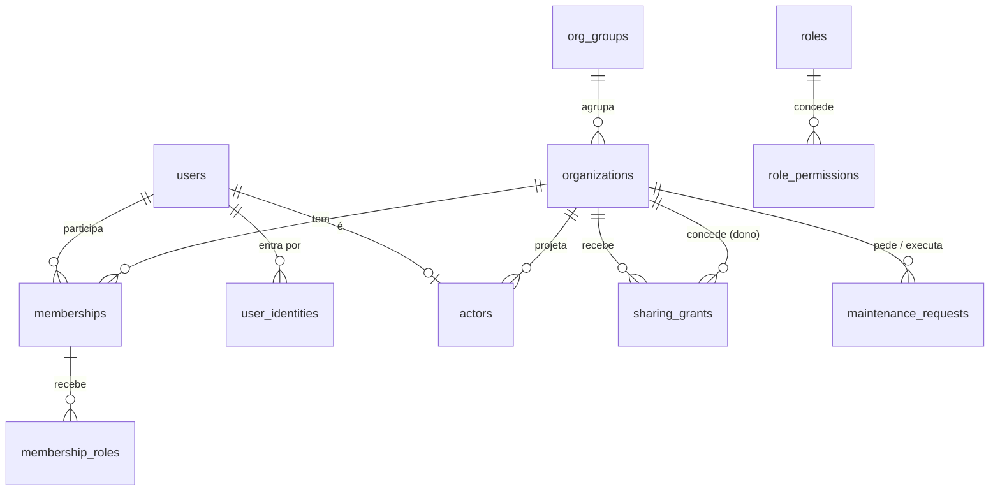

# Plataforma e ecossistema

A plataforma é destacável para o futuro Hub ([ADR-010](../adrs/adr-010-v2-do-nucleo.md)): os outros módulos só referenciam `organizations` e `actors`, nunca `users`. O ecossistema permite que organizações compartilhem dados por concessão, sem abrir tabelas internas ([ADR-011](../adrs/adr-011-ecossistema-e-compartilhamento.md)).



## Organizações e grupo econômico

```sql
create table org_groups (
  id          uuid primary key,
  name        text not null,
  created_at  timestamptz not null default now()
);

create table organizations (
  id               uuid primary key,
  group_id         uuid references org_groups(id),      -- mesmo grupo = nível "completo" possível (ECO-5)
  legal_name       text not null,
  trade_name       text,
  country          char(2) not null default 'BR',       -- ISO 3166; as empresas do ecossistema são globais
  tax_id           text not null,                       -- CNPJ no Brasil; o documento fiscal do país nos outros
  kinds            text[] not null,                     -- shipper, carrier, workshop, roadside
  asset_kinds_serviced text[] not null default '{}',    -- oficina: power_unit, semi_trailer…
  locale           text not null default 'pt-BR',
  currency         char(3) not null default 'BRL',
  timezone         text not null default 'America/Sao_Paulo',
  plan_id          uuid references plans(id),
  is_demo          boolean not null default false,       -- organização de demonstração para o cliente
  created_at       timestamptz not null default now(),
  check (kinds <@ array['shipper','carrier','workshop','roadside']),
  unique (country, tax_id)
);
```

`organizations` tem RLS: cada organização lê a si mesma (`app.org_id`) e o usuário lê as organizações das quais é membro ativo (`app.user_id`, política `member_read`), que é o que o login precisa para listar as empresas.

## Identidade (destacável para o Hub)

Usuários, credenciais, vínculos com organizações, sessões e tentativas de login ficam no schema `identity` do banco, fora do RLS por organização, porque são lidos antes de existir organização na sessão. É o pedaço que vai para o Hub. Sessão: [ADR-015](../adrs/adr-015-sessao-opaca-em-cookie.md).

```sql
create table users (
  id            uuid primary key,
  name          text not null,
  email         text unique,                  -- opcional: mecânico pode não ter e-mail
  locale        text,                         -- sobrescreve o da organização
  created_at    timestamptz not null default now(),
  deactivated_at timestamptz
);

create table user_identities (                -- como a pessoa entra
  id            uuid primary key,
  user_id       uuid not null references users(id),
  provider      text not null,                -- password, oidc_entra, oidc_google, pin
  subject       text not null,                -- id no provedor, e-mail ou matrícula
  secret_hash   text,                         -- senha ou PIN (argon2); null para OIDC
  org_id        uuid references organizations(id),  -- PIN vale dentro de uma organização
  created_at    timestamptz not null default now(),
  unique (provider, subject, org_id),
  check (provider in ('password','oidc_entra','oidc_google','pin'))
);

create table memberships (                    -- no schema identity: consultada no login, antes de existir organização
  id            uuid primary key,
  org_id        uuid not null references organizations(id),
  user_id       uuid not null references users(id),
  employee_id   uuid,                         -- vínculo com o funcionário (pessoas)
  status        text not null default 'active' check (status in ('invited','active','suspended')),
  created_at    timestamptz not null default now(),
  unique (org_id, user_id)                    -- PLT-3
);

create table sessions (                       -- ADR-015: token opaco no cookie; só o hash no banco
  id              uuid primary key,
  user_id         uuid not null references users(id),
  token_hash      bytea not null unique,
  active_org_id   uuid references organizations(id),
  active_actor_id uuid references actors(id),
  created_at      timestamptz not null default now(),
  last_seen_at    timestamptz not null default now(),   -- gravado no máximo a cada 5 minutos
  expires_at      timestamptz not null,                  -- 30 dias; inatividade de 12 horas também encerra
  revoked_at      timestamptz,
  user_agent      text
);

create table login_attempts (                 -- 5 falhas em 15 minutos bloqueiam o e-mail
  id            uuid primary key,
  email         text not null,
  succeeded     boolean not null,
  attempted_at  timestamptz not null default now()
);

create table actors (                         -- projeção local de quem age; alvo das FKs de auditoria
  id            uuid primary key,
  org_id        uuid not null references organizations(id),
  user_id       uuid references users(id),    -- null para sistema ou integração
  kind          text not null check (kind in ('user','system','integration')),
  display_name  text not null,                -- nome no momento, para relatórios
  unique (org_id, user_id),
  check ((kind = 'user') = (user_id is not null))
);
```

Quando o Hub existir, `users` e `user_identities` saem daqui e `actors` passa a ser alimentada pelo Hub. Nada mais muda.

## Permissões

```sql
create table permissions (                    -- catálogo fixo, versionado no código
  code          text primary key              -- work_order.finish, part_request.approve…
);

create table roles (
  id            uuid primary key,
  org_id        uuid references organizations(id),   -- null = papel padrão do sistema
  code          text not null,
  is_system     boolean not null default false,
  unique (org_id, code)
);

create table role_permissions (
  role_id       uuid not null references roles(id),
  permission    text not null references permissions(code),
  scope         text not null default 'org' check (scope in ('org','own','base')),  -- "own" = só o que é meu
  primary key (role_id, permission)
);

create table membership_roles (
  id            uuid primary key,
  membership_id uuid not null references memberships(id),
  role_id       uuid not null references roles(id),
  base_id       uuid references bases(id),     -- papel limitado a uma base; o mesmo papel pode valer em várias
  unique nulls not distinct (membership_id, role_id, base_id)
);
```

O escopo `own` é aplicado na query (ex.: mecânico só vê OS com sessão ou designação dele). Mudança em `membership_roles` invalida sessão e cache na hora.

## Planos e funcionalidades

```sql
create table plans (
  id            uuid primary key,
  code          text not null unique,
  billing_metric text not null check (billing_metric in ('vehicle','serviced_fleet')),
  price_tiers   jsonb not null                 -- faixas progressivas; validadas pelo código
);

create table org_features (                    -- liberação por organização: módulos, "em breve", rollout
  org_id        uuid not null references organizations(id),
  feature       text not null,                 -- truck.tires, truck.preventive…
  state         text not null check (state in ('enabled','coming_soon','disabled')),
  primary key (org_id, feature)
);

create table feature_interests (               -- "Quero isso"
  id            uuid primary key,
  org_id        uuid not null references organizations(id),
  actor_id      uuid not null references actors(id),
  feature       text not null,
  use_case      text,                          -- "o que você faria com isso?"
  notify        boolean not null default true,
  created_at    timestamptz not null default now(),
  unique (org_id, actor_id, feature)
);
```

## Ecossistema

```sql
create table sharing_grants (
  id              uuid primary key,
  owner_org_id    uuid not null references organizations(id),   -- quem é dono do dado e concede
  grantee_org_id  uuid not null references organizations(id),   -- quem passa a ver
  level           text not null check (level in ('status','services','billed','full')),
  scope           jsonb not null,               -- ativos, conjuntos ou frotas incluídos
  valid_during    tstzrange not null,
  revoked_at      timestamptz,
  granted_by      uuid not null references actors(id),
  created_at      timestamptz not null default now(),
  check (owner_org_id <> grantee_org_id)
);
-- ECO-5: "full" só dentro do mesmo grupo, validado por trigger que compara organizations.group_id
```

```sql
create table maintenance_requests (            -- dono do ativo pede manutenção a uma oficina
  id                uuid primary key,
  requester_org_id  uuid not null references organizations(id),
  provider_org_id   uuid not null references organizations(id),
  vehicle_id        uuid,                      -- veículo avulso do solicitante
  trailer_set_id    uuid,                      -- ou o conjunto inteiro (a Vale pede por frota)
  description       text not null,
  status            text not null check (status in ('open','accepted','rejected','done','canceled')),
  work_order_id     uuid,                      -- OS criada na oficina ao aceitar
  share_level       text not null check (share_level in ('status','services','billed')),
  created_by        uuid not null references actors(id),
  created_at        timestamptz not null default now(),
  version           int not null default 0,
  check (num_nonnulls(vehicle_id, trailer_set_id) = 1)
);
```

**Visões compartilhadas:** para cada concessão ativa, eventos da organização dona alimentam tabelas `shared_*` (ex.: `shared_work_orders`, `shared_vehicle_costs`) com `grantee_org_id` e só as colunas permitidas pelo nível. O RLS dessas tabelas usa `grantee_org_id`. Revogar a concessão apaga as linhas. Um teste gerado do catálogo de níveis garante que nenhum campo acima do nível é publicado (ECO-4).

## Novidades (conteúdo da plataforma)

Escritas pela equipe Facter, lidas por todas as empresas ([ADR-016](../adrs/adr-016-conteudo-da-plataforma.md)). A entrada é da plataforma; o pedido "Quero isso" é da empresa.

```sql
create schema platform;

alter table identity.users add column platform_staff boolean not null default false;   -- só por migration ou script
alter table identity.users add column updates_seen_at timestamptz;                     -- "Nova para você" e ponto no menu

create table platform.product_update_images (
  id            uuid primary key,
  content_type  text not null check (content_type in ('image/png','image/jpeg')),
  bytes         bytea not null check (octet_length(bytes) <= 1048576),
  created_at    timestamptz not null default now()
);

create table platform.product_updates (
  id            uuid primary key,
  kind          text not null check (kind in ('feature','improvement','fix','upcoming')),
  title         text not null check (char_length(title) between 3 and 70),
  body          text not null check (char_length(body) between 3 and 280),
  audience      text[] not null default '{}',       -- owner, fleet_management, finance, yard, workshop, stock, tires; vazio = todos
  destination   text,                               -- tela do "Experimentar" / "Ver em", chave da web (vehicles, …)
  important     boolean not null default false,     -- banner no Início; uma por vez
  feature_key   text unique,                        -- só em upcoming: liga o pedido ao lugar onde a função vai morar
  collecting    text check (char_length(collecting) <= 160),  -- só em upcoming: o que já é registrado hoje
  image_id      uuid references platform.product_update_images(id),
  image_alt     text,
  locale        text not null default 'pt-BR',
  status        text not null default 'published' check (status in ('published','withdrawn','shipped')),
  shipped_as    uuid references platform.product_updates(id),   -- upcoming que virou nova função
  published_at  timestamptz not null default now(),
  created_by    uuid not null references identity.users(id),
  check (kind <> 'upcoming' or (collecting is not null and feature_key is not null and image_id is null and destination is null and not important)),
  check (kind =  'upcoming' or (collecting is null and feature_key is null)),
  check (kind <> 'fix' or (cardinality(audience) = 0 and destination is null and image_id is null and not important)),
  check (image_id is null or image_alt is not null),
  check ((status = 'shipped') = (shipped_as is not null))
);
create index product_updates_feed_idx on platform.product_updates (published_at desc, id desc) where status = 'published' and kind <> 'upcoming';
create unique index product_updates_one_banner on platform.product_updates ((true)) where important and status = 'published';

create table identity.product_update_dismissals (
  user_id     uuid not null references identity.users(id),
  update_id   uuid not null references platform.product_updates(id),
  dismissed_at timestamptz not null default now(),
  primary key (user_id, update_id)
);

create table product_update_interests (             -- dado da empresa: RLS forçado por org_id
  id               uuid primary key,
  org_id           uuid not null references organizations(id),
  actor_id         uuid not null references actors(id),
  update_id        uuid not null references platform.product_updates(id),
  note             text check (char_length(note) <= 500),
  notify           boolean not null default true,
  created_at       timestamptz not null default now(),
  withdrawn_at     timestamptz,
  arrival_seen_at  timestamptz                       -- fechou o aviso "seu pedido chegou"
);
create unique index product_update_interests_open on product_update_interests (org_id, actor_id, update_id) where withdrawn_at is null;
create index product_update_interests_by_update on product_update_interests (org_id, update_id) where withdrawn_at is null;
```

- **Nova para você** é o que foi publicado depois de `updates_seen_at`; abrir Novidades grava o horário.
- **Ponto no menu** conta só nova função e melhoria, publicadas depois da última visita, para o público da pessoa. Correção nunca acende o ponto.
- **Banner**: a única entrada `important` publicada, se for para o público da pessoa e ela não tiver fechado.
- **Pedido que chegou**: pedido aberto, com `notify`, de entrada `shipped`, ainda sem `arrival_seen_at`.

## Infraestrutura de dados

```sql
create table outbox (                          -- eventos gravados na mesma transação do comando
  id            uuid primary key,
  org_id        uuid not null,
  type          text not null,                 -- work_order.finished…
  payload       jsonb not null,
  created_at    timestamptz not null default now(),
  published_at  timestamptz
);
create index on outbox (created_at) where published_at is null;

create table idempotency_keys (
  org_id        uuid not null,
  key           text not null,
  request_hash  text not null,
  response      jsonb,
  created_at    timestamptz not null default now(),
  primary key (org_id, key)
);

create table sequences (                       -- numeração sem max+1 (WO-5)
  org_id        uuid not null,
  name          text not null,                 -- work_order:CO, maintenance_request…
  next_value    bigint not null default 1,
  primary key (org_id, name)
);

create table admin_audit_log (                 -- quem mudou permissão, configuração, plano
  id            uuid primary key,
  org_id        uuid,
  actor_id      uuid not null,
  action        text not null,
  target        text not null,
  before        jsonb,
  after         jsonb,
  created_at    timestamptz not null default now()
);

create table terms_acceptances (
  user_id       uuid not null references users(id),
  terms_version text not null,
  accepted_at   timestamptz not null default now(),
  primary key (user_id, terms_version)
);
```

## Integração com ERP (SAP e outros)

A integração em si fica para depois do lançamento, mas o modelo nasce pronto: a Suzano integra quase tudo com o SAP, e mapear depois de um schema fechado custa caro.

```sql
create table external_refs (                  -- substitui externalId/externalSource repetidos em cada tabela do v1
  id            uuid primary key,
  org_id        uuid not null references organizations(id),
  entity        text not null,                 -- vehicle, work_order, work_session, stock_movement, part…
  entity_id     uuid not null,
  system        text not null,                 -- sap, totvs, telematics…
  external_id   text not null,                 -- nº do equipamento, ordem, confirmação, documento de material
  synced_at     timestamptz,
  sync_status   text not null default 'pending' check (sync_status in ('pending','synced','failed')),
  unique (org_id, system, entity, external_id),
  unique (org_id, system, entity, entity_id)
);

create table data_ownership (                 -- quem é dono de cada cadastro, por organização
  org_id        uuid not null references organizations(id),
  entity        text not null,                 -- part, cost_center, vehicle…
  owner_system  text not null,                 -- truck ou sap: se sap, o Truck importa e bloqueia a edição
  primary key (org_id, entity)
);
```

| SAP PM / MM | v2 |
| --- | --- |
| Equipamento (EQUI) | `vehicles` |
| Centro / depósito | `bases` / `depots` (com código SAP) |
| Nota de manutenção (QMEL) | `maintenance_requests` |
| Ordem de manutenção (AUFK/AFIH) | `work_orders` |
| Operação (AFVC) | `service_executions` |
| Confirmação de horas (AFRU) | `work_sessions` |
| Reserva (RESB) | `part_requests` |
| Movimento de material (MSEG 261/262) | `stock_movements` |
| Mestre de material (MARA) | `parts` |
| Documento de medição (IMRG) | `meter_readings` |
| Centro de custo (CSKS) | centros de custo (depois) |

Regras: a integração sai pelo outbox para um worker com retentativa e idempotência, nunca da requisição; se o ERP estiver fora do ar, a oficina segue trabalhando. Códigos no formato do ERP (centro, depósito, unidade ISO, material) ficam guardados junto das entidades correspondentes.

## Invariantes garantidos aqui

PLT-1 a PLT-7, ECO-2 a ECO-5, WO-5 (via `sequences`).

## Decidido em 26/09/2026

- `actors` por organização: simplifica o RLS, e a auditoria é sempre dentro de uma organização.
- `price_tiers` em `jsonb`, enquanto os planos forem poucos e fechados por contrato.
