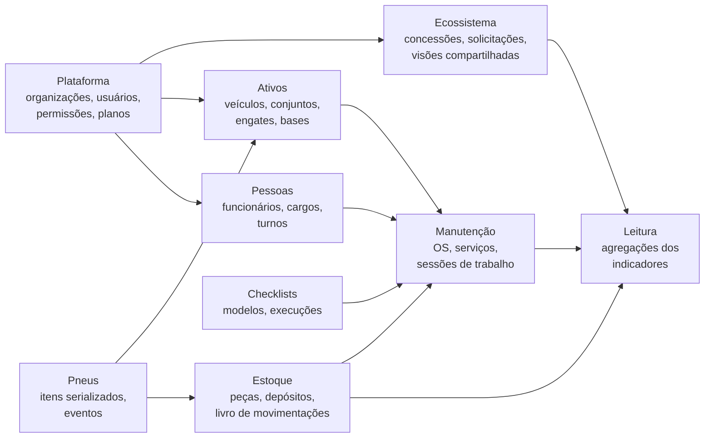

# Visão geral do schema v2

:::info[Proposta em discussão]
Esboço para revisão da arquiteta antes de qualquer código. Aplica os [padrões de engenharia](../padroes/padroes-de-engenharia.md), garante os [invariantes](../invariantes.md), grava os fatos dos [indicadores de decisão](../../produto/indicadores-de-decisao.md) e segue o [ADR-011](../adrs/adr-011-ecossistema-e-compartilhamento.md).
:::

O schema v2 tem 9 módulos. Todo dado de negócio pertence a uma organização, o banco garante as regras que não podem falhar, e fatos (transições, movimentações, sessões) só recebem inserções.

## Mapa de módulos



## Diagrama completo

Todas as tabelas do schema v2 e como se ligam. Clique em **Expandir** para ver em tela cheia, arrastar e dar zoom. As colunas estão nas páginas de cada módulo.

```mermaid
erDiagram
  org_groups ||--o{ organizations : agrupa
  organizations ||--o{ memberships : tem
  users ||--o{ memberships : participa
  users ||--o{ user_identities : "entra por"
  organizations ||--o{ actors : projeta
  users ||--o| actors : "é"
  memberships ||--o{ membership_roles : recebe
  roles ||--o{ membership_roles : "atribuído"
  roles ||--o{ role_permissions : concede
  permissions ||--o{ role_permissions : "em"
  plans ||--o{ organizations : assina
  organizations ||--o{ org_features : libera
  organizations ||--o{ feature_interests : "quero isso"
  organizations ||--o{ sharing_grants : "concede e recebe"
  organizations ||--o{ maintenance_requests : "pede e executa"

  organizations ||--o{ vehicles : "é dona"
  axle_layouts ||--o{ vehicles : "layout"
  vehicles ||--o{ axles : tem
  axles ||--o{ wheel_positions : tem
  vehicles ||--o{ wheel_positions : "estepe"
  vehicles ||--o{ vehicle_status_transitions : "status no tempo"
  trailer_set_types ||--o{ trailer_sets : tipifica
  trailer_sets ||--o{ trailer_set_slots : posições
  vehicles ||--o{ trailer_set_slots : ocupa
  vehicles ||--o{ couplings : traciona
  trailer_sets ||--o{ couplings : engatado
  vehicles ||--o{ vehicle_operators : "operado por"
  vehicles ||--o{ meter_readings : leituras
  vehicles ||--o{ meter_installs : "medidor instalado"
  meter_installs ||--o{ meter_readings : "lido em"
  vehicles ||--o{ vehicle_links : "vínculo"
  organizations ||--o{ bases : tem
  bases ||--o{ boxes : tem

  job_titles ||--o{ job_title_rates : "custo/hora"
  job_titles ||--o{ employees : cargo
  shifts ||--o{ employees : turno
  shifts ||--o{ shift_segments : "trabalho e intervalos"
  organizations ||--o{ org_holidays : feriados
  organizations ||--o{ labor_premiums : adicionais
  bases ||--o{ employees : lotação

  bases ||--o{ work_orders : executa
  boxes ||--o{ work_orders : ocupa
  maintenance_requests ||--o| work_orders : gera
  vehicle_stoppages ||--o{ work_orders : "parada que trouxe"
  vehicles ||--o{ vehicle_stoppages : parou
  workshop_customers ||--o{ work_orders : cliente
  work_orders ||--o{ work_order_forecasts : "previsão de liberação"
  pause_reasons ||--o{ work_sessions : motivo
  work_orders ||--o{ work_order_vehicles : atende
  vehicles ||--o{ work_order_vehicles : "na OS"
  work_orders ||--o{ work_order_transitions : histórico
  work_orders ||--o{ service_executions : contém
  service_categories ||--o{ service_types : agrupa
  service_types ||--o{ service_executions : tipifica
  components ||--o{ service_executions : componente
  service_executions ||--o| service_executions : "retorno de"
  service_executions ||--o{ execution_assignments : executores
  employees ||--o{ execution_assignments : executa
  execution_assignments ||--o{ work_sessions : sessões
  work_orders ||--o{ external_services : externo
  work_orders ||--o{ work_order_cost_lines : custos
  work_orders ||--o{ attachments : fotos
  work_orders ||--o{ work_order_notes : notas

  part_categories ||--o{ parts : agrupa
  units ||--o{ parts : unidade
  suppliers ||--o{ parts : fornece
  depots ||--o{ depot_operators : "operado por"
  depots ||--o{ stock_balances : guarda
  parts ||--o{ stock_balances : saldo
  depots ||--o{ stock_movements : registra
  parts ||--o{ stock_movements : move
  part_requests ||--o{ part_request_items : itens
  part_request_items ||--o{ stock_movements : gera
  suppliers ||--o{ stock_receipts : "nota fiscal"
  stock_receipts ||--o{ stock_movements : entrada
  suppliers ||--o{ external_services : presta
  work_orders ||--o{ part_requests : pede
  part_requests ||--o{ part_request_transitions : histórico
  parts ||--o{ serialized_items : "unidades"
  serialized_items ||--o{ serialized_item_events : eventos
  wheel_positions ||--o| serialized_items : "montado em"
  serialized_items ||--o| tires : "é pneu"
  tires ||--o{ tire_inspections : inspeções

  checklist_templates ||--o{ checklist_template_versions : versões
  checklist_template_versions ||--o{ checklist_template_items : itens
  checklist_template_versions ||--o{ checklists : execuções
  checklist_results ||--o{ attachments : foto
  checklists ||--o{ checklist_results : resultados
  checklist_results ||--o| service_executions : "gera serviço"

  organizations ||--o{ allocation_periods : rateio
  allocation_periods ||--o{ allocation_shares : parcelas
  vehicles ||--o{ allocation_shares : recebe
  vehicles ||--o{ daily_vehicle_facts : "fatos diários"
  trailer_sets ||--o{ daily_trailer_set_facts : "fatos por frota"
  employees ||--o{ daily_employee_facts : "fatos diários"
  vehicles ||--o{ recurring_failures : "falhas recorrentes"
```



| Módulo | Página | Responsável por |
| --- | --- | --- |
| Plataforma e ecossistema | [Plataforma e ecossistema](./plataforma-e-ecossistema.md) | Organizações, grupos, identidade, permissões, planos, concessões de compartilhamento, solicitações entre organizações, "Quero isso", auditoria, outbox |
| Ativos | [Ativos](./ativos.md) | Veículos por tipo formal e histórico de status, eixos, posições e estepe, conjuntos de implementos, engates (inclusive com tratora de fora), operador ao longo do tempo, bases e boxes, medidores com troca de painel |
| Manutenção | [Manutenção](./manutencao.md) | Paradas do veículo, OS com previsão de liberação, clientes da oficina, serviços, executores, sessões de trabalho com intervalos, retrabalho, serviços externos com nota, custo interno e valor cobrado |
| Estoque | [Estoque](./estoque.md) | Catálogo de peças, fornecedores, notas de entrada, depósitos com dono e local, saldo com reserva e mínimo, livro de movimentações, itens serializados, requisições com itens |
| Pessoas, pneus e checklists | [Pessoas, pneus e checklists](./pessoas-pneus-checklists.md) | Funcionários, cargos com custo/hora histórico e adicionais, turnos com intervalos e feriados; pneus como itens serializados, com inspeção por posição e km; checklists versionados que geram serviço |
| Rateio e leitura | [Rateio e leitura](./rateio-e-leitura.md) | Períodos de rateio, agregações diárias que alimentam os 13 indicadores, exportação e resumo semanal |

## Convenções

| Tema | Regra |
| --- | --- |
| Nomes | Tabelas e colunas em `snake_case`, inglês, tabelas no plural. Textos de tela vêm das traduções, nunca do banco |
| Ids | `uuid` v7 (ordenado por tempo) em toda tabela |
| Organização | Toda tabela de negócio tem `org_id uuid not null references organizations`. É a coluna do RLS |
| RLS | `enable row level security` em toda tabela com `org_id`. Política: `org_id = current_setting('app.org_id')::uuid`, definido com `set local` dentro de cada transação (funciona com pooler em modo transação). Sem contexto, nada é devolvido |
| Autoria | Fatos têm `actor_id uuid not null references actors` (quem agiu). Nunca o id da empresa |
| Tempo | `timestamptz`, `created_at default now()`, `updated_at` mantido por trigger. Hora do dia é `time` |
| Dinheiro | `numeric(14,2)` com `currency char(3)` no mesmo registro ou na organização |
| Quantidade | `numeric(14,4)` com a unidade explícita |
| Status | `text` com `check (status in (...))`: mais fácil de evoluir que enum do Postgres; o código tem o tipo |
| Concorrência | Agregados têm `version int not null default 0`; toda atualização é `where id = $1 and version = $2` |
| Histórico | `restrict` por padrão nas FKs; cadastros têm `deleted_at`; fatos só recebem insert |
| Períodos | Históricos com início e fim usam `tstzrange` e `exclude using gist` para impedir sobreposição |

```sql
-- Padrão de toda tabela de negócio
create table example (
  id          uuid primary key,
  org_id      uuid not null references organizations(id),
  created_at  timestamptz not null default now(),
  updated_at  timestamptz not null default now(),
  version     int not null default 0
);
alter table example enable row level security;
create policy tenant_isolation on example
  using (org_id = current_setting('app.org_id', true)::uuid);
```

## ORM

**Prisma 7**, decidido no [ADR-013](../adrs/adr-013-orm-prisma.md) depois de uma prova com Prisma e Drizzle contra 100 mil OS. Regras: `relationJoins` sempre ligado, consultas quentes em SQL tipado (TypedSQL), constraints e RLS em migrations SQL com teste de integração cada uma, e lint de `@map`/`@@map` em snake_case. Os blocos SQL desta seção são a forma final no banco; no `schema.prisma` ficam os modelos, e o que ele não expressa vai nas migrations.

## Ordem de construção

1. Plataforma (organizações, identidade, atores, permissões) e o padrão de RLS.
2. Ativos e pessoas.
3. Manutenção e estoque juntos, porque a requisição de peça liga os dois.
4. Ecossistema (concessões, solicitações, visões compartilhadas).
5. Pneus e checklists.
6. Leitura (agregações dos indicadores) e rateio.
