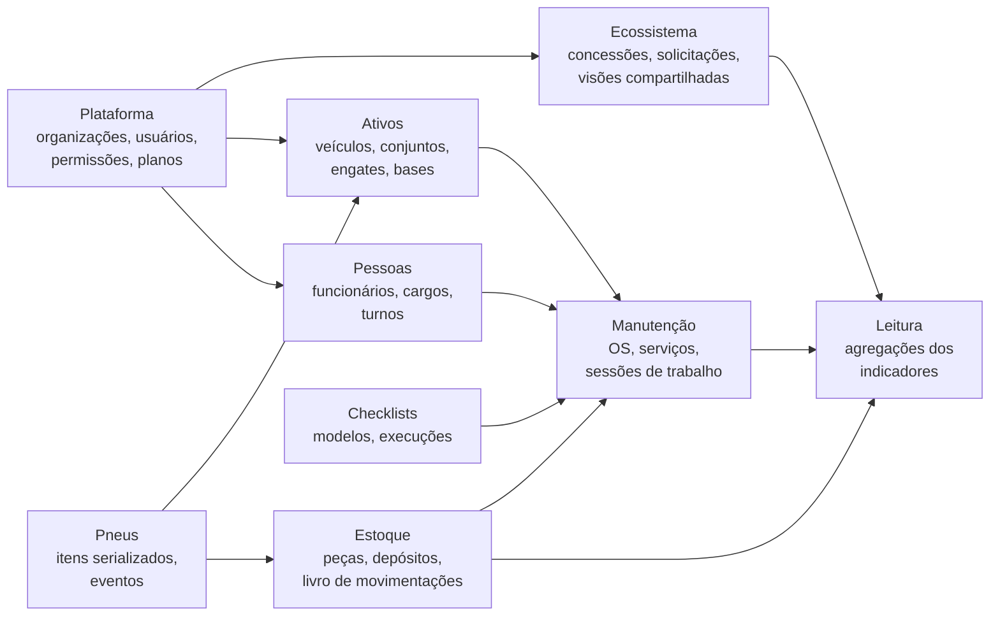

# Visão geral do schema v2

:::info Proposta em discussão
Esboço para revisão da arquiteta antes de qualquer código. Aplica os [padrões de engenharia](../padroes/padroes-de-engenharia.md), garante os [invariantes](../invariantes.md), grava os fatos dos [indicadores de decisão](../../produto/indicadores-de-decisao.md) e segue o [ADR-011](../adrs/adr-011-ecossistema-e-compartilhamento.md).
:::

O schema v2 tem 9 módulos. Todo dado de negócio pertence a uma organização, o banco garante as regras que não podem falhar, e fatos (transições, movimentações, sessões) só recebem inserções.

## Mapa de módulos



| Módulo | Página | Responsável por |
| --- | --- | --- |
| Plataforma e ecossistema | [Plataforma e ecossistema](./plataforma-e-ecossistema.md) | Organizações, grupos, identidade, permissões, planos, concessões de compartilhamento, solicitações entre organizações, "Quero isso", auditoria, outbox |
| Ativos | [Ativos](./ativos.md) | Veículos por tipo formal, eixos e posições, conjuntos de implementos, engates, operador ao longo do tempo, bases e boxes, contadores |
| Manutenção | [Manutenção](./manutencao.md) | OS, serviços, executores, sessões de trabalho, retrabalho, serviços externos, custo interno e valor cobrado |
| Estoque | [Estoque](./estoque.md) | Catálogo de peças, unidades, depósitos com dono e local, livro de movimentações, itens serializados, requisições |
| Pessoas, pneus e checklists | [Pessoas, pneus e checklists](./pessoas-pneus-checklists.md) | Funcionários, cargos com custo/hora histórico, turnos; pneus como itens serializados; checklists que geram serviço |
| Rateio e leitura | [Rateio e leitura](./rateio-e-leitura.md) | Períodos de rateio, agregações diárias que alimentam os 13 indicadores, exportação e resumo semanal |

## Convenções

| Tema | Regra |
| --- | --- |
| Nomes | Tabelas e colunas em `snake_case`, inglês, tabelas no plural. Textos de tela vêm das traduções, nunca do banco |
| Ids | `uuid` v7 (ordenado por tempo) em toda tabela |
| Organização | Toda tabela de negócio tem `org_id uuid not null references organizations`. É a coluna do RLS |
| RLS | `enable row level security` em toda tabela com `org_id`. Política: `org_id = current_setting('app.org_id')::uuid`, definido com `set local` dentro de cada transação (funciona com pooler em modo transação). Sem contexto, nada é devolvido |
| Autoria | Fatos têm `actor_id uuid not null references actors` (quem agiu). Nunca o id da empresa |
| Tempo | `timestamptz`, `created_at default now()`, `updated_at` mantido por trigger. Hora do dia é `time` |
| Dinheiro | `numeric(14,2)` com `currency char(3)` no mesmo registro ou na organização |
| Quantidade | `numeric(14,4)` com a unidade explícita |
| Status | `text` com `check (status in (...))`: mais fácil de evoluir que enum do Postgres; o código tem o tipo |
| Concorrência | Agregados têm `version int not null default 0`; toda atualização é `where id = $1 and version = $2` |
| Histórico | `restrict` por padrão nas FKs; cadastros têm `deleted_at`; fatos só recebem insert |
| Períodos | Históricos com início e fim usam `tstzrange` e `exclude using gist` para impedir sobreposição |

```sql
-- Padrão de toda tabela de negócio
create table example (
  id          uuid primary key,
  org_id      uuid not null references organizations(id),
  created_at  timestamptz not null default now(),
  updated_at  timestamptz not null default now(),
  version     int not null default 0
);
alter table example enable row level security;
create policy tenant_isolation on example
  using (org_id = current_setting('app.org_id', true)::uuid);
```

## ORM

O schema usa recursos que o Prisma não expressa no próprio schema: `check`, índice único parcial, `exclude using gist` e políticas de RLS. No Prisma, tudo isso iria para migrations em SQL escritas à mão e ficaria invisível no modelo.

**Proposta:** Drizzle ORM, que declara `check`, índices parciais e políticas de RLS junto da tabela. O que não tiver suporte (o `exclude`) vai em migration SQL, comentada. A decisão vira **ADR-013** depois de uma prova de conceito na fase 0: uma tabela com RLS, `check`, índice parcial e `exclude`, testada contra Postgres real.

## Ordem de construção

1. Plataforma (organizações, identidade, atores, permissões) e o padrão de RLS.
2. Ativos e pessoas.
3. Manutenção e estoque juntos, porque a requisição de peça liga os dois.
4. Ecossistema (concessões, solicitações, visões compartilhadas).
5. Pneus e checklists.
6. Leitura (agregações dos indicadores) e rateio.
